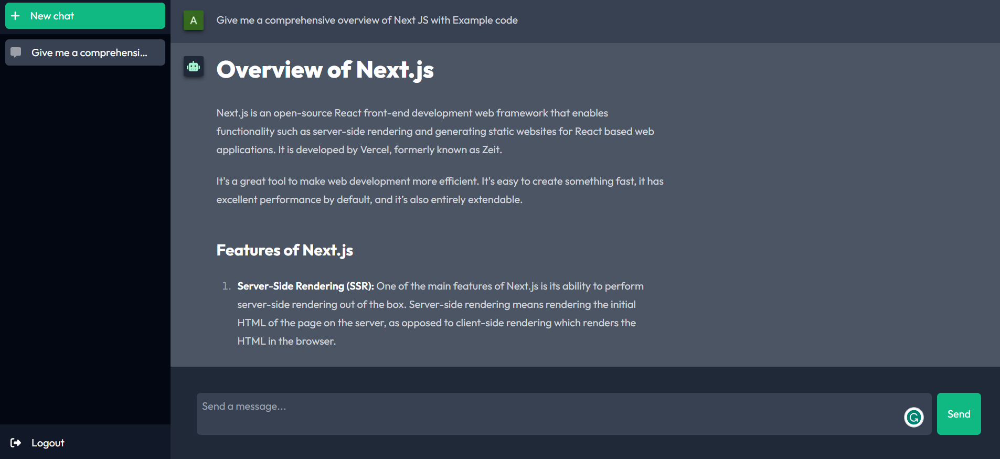
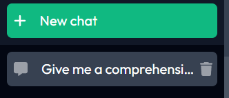

# LongGPT


## Table of Contents

- [Project Description](#project-description)
- [Tech Stack](#tech-stack)
- [Features](#features)
- [Installation](#installation)
- [Usage](#usage)
- [Contributing](#contributing)
- [License](#license)

## Project Description

LongGPT is an AI-powered conversational application utilizing the LongShot API, characterized by its human-like conversational abilities, factual accuracy, and capacity to provide highly relevant and precise responses.

## Tech Stack

List of technologies, frameworks, and tools used in this project.

- Next JS - Next.js (^13.0) with a structured "pages" directory.
- Next JS(Backend) - Next.js (Inbuilt API Directory) serving as both the frontend and backend.
- Database - MongoDB, used for data storage and retrieval.
- NextJS backend framework - Express.js, integrated within the Next.js backend to handle API requests and routing.

## Features

The key features of LongGPT:

### Authentication System


Authentication system, encompassing both user registration (Sign-Up) and login processes, is enhanced by the implementation of an OAuth Client Library, providing a swift and effortless experience for users.

### Multiple chat instances



 - It enables users to engage in several distinct and simultaneous chat sessions within a single interface, enhancing multitasking and versatility. 
 - This functionality is particularly useful in scenarios where users need to manage multiple conversations, inquiries, or tasks concurrently. 
 - Whether it's providing customer support, handling various queries, or assisting with diverse topics, the Multiple Chat Instances feature optimizes efficiency and responsiveness.

 ### Delete chat instances

 

 - This feature allows users to delete specific chat instances within the AI chatbot platform. Chat instances are individual conversations or interactions between users and the chatbot. 
 - By providing the ability to delete chat instances, users can maintain privacy, manage their chat history, and declutter their chat interface.

## Installation

- Clone the Repository
- Install the necessary Dependencies
- Start the dev server

```bash
# Clone the repository
git clone https://github.com/Abdul-Maajith/LongGPT.git

# Install dependencies
cd longshotGPT
npm install
npm run dev
```

# Usage
1. **Authentication (Auth):** Users can securely authenticate themselves within the chatbot environment, ensuring data privacy and access control.

2. **Create Chat:** Users have the ability to initiate new chat sessions with the AI, enabling them to seek information, ask questions, or engage in meaningful conversations.

3. **Conversation with AI:** This feature empowers users to interact with the AI chatbot, providing them with answers to queries, assistance, and relevant information in a conversational manner.

4. **Moving to Multiple Chat Instances:** Users can seamlessly transition between multiple chat instances, allowing them to multitask or engage in different conversations without interruption.

5. **Delete Chat Instance:** When no longer needed, users can effortlessly remove chat instances, decluttering their chat history and maintaining a clean and organized interface.

# open-source contribtion
We welcome contributions from the community to improve LongGPT. To ensure a smooth and collaborative development process, please follow these guidelines:

## Getting Started

1. Fork the repository to your GitHub account.

2. Clone your forked repository to your local machine:

```bash
 git clone https://github.com/yourusername/your-project.git
```

3. Create a new branch for your feature development or bug fix:

```bash
 git checkout -b feature-name
```

4. To stay up to date with the main branch:

```bash
 git pull origin main
```

5. Make changes and work on your feature!

6. Commit your changes with a descriptive commit message:

```bash
 git commit -m "Add feature-name"
```

7. Creating a Pull Request (PR) and wait for Approval

# Thanks!!
